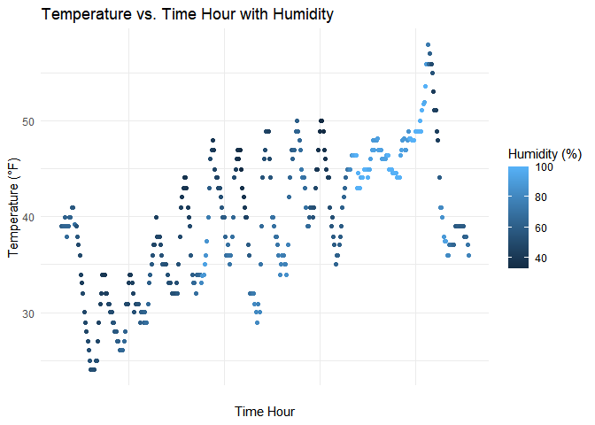

p8105_hw1_cz2750
================
2023-09-23

# Load the library

### P1

## Description of the dataset

## Variables:

# - `time_hour`: Date and time

# - `temp`: Temperature (in degrees Fahrenheit)

# - `humid`: Humidity (as a percentage)

# - `wind_speed`: Wind speed (in miles per hour)

## Size of the dataset:

``` r
n_rows <- nrow(early_january_weather)
n_cols <- ncol(early_january_weather)
```

# Calculate the mean temperature

``` r
mean_temp <- mean(early_january_weather$temp)
```

# Print dataset information

``` r
cat("Variables:", names(early_january_weather), "\n")
```

    ## Variables: origin year month day hour temp dewp humid wind_dir wind_speed wind_gust precip pressure visib time_hour

``` r
cat("Size of the dataset (rows x columns):", n_rows, "x", n_cols, "\n")
```

    ## Size of the dataset (rows x columns): 358 x 15

``` r
cat("Mean Temperature:", round(mean_temp, 2), "°F\n")
```

    ## Mean Temperature: 39.58 °F

# Scatterplot of temp vs. time_hour colored by humid

``` r
library(ggplot2)
```

# Create the scatterplot

``` r
scatterplot <- ggplot(early_january_weather, aes(x = time_hour, y = temp, color = humid)) +
  geom_point() +
  labs(x = "Time Hour", y = "Temperature (°F)", color = "Humidity (%)", title = "Temperature vs. Time Hour with Humidity") +
  theme_minimal()
```

# Export the scatterplot to the project directory

``` r
ggsave("scatterplot.png", plot = scatterplot, width = 8, height = 6, units = "in")
```

# Show the scatterplot in the document

``` r
scatterplot
```

<!-- -->

### p2

# Create a data frame

``` r
my_df <- data.frame(
  random_sample = rnorm(10), 
  logical_vector = rnorm(10) > 0,
  character_vector = sample(letters, 10, replace = TRUE), 
  factor_vector = as.factor(sample(1:3, 10, replace = TRUE)) 
)
```

# Attempt to take the mean of each variable

# This will work for the ‘random_sample’ variable but not for others

``` r
mean_random <- mean(my_df$random_sample)
mean_logical <- mean(my_df$logical_vector)
mean_character <- mean(my_df$character_vector)
mean_factor <- mean(my_df$factor_vector)
```

# Code chunk for variable type conversion

``` r
my_df$logical_vector <- as.numeric(my_df$logical_vector)
my_df$character_vector <- as.numeric(my_df$character_vector)
my_df$factor_vector <- as.numeric(my_df$factor_vector)
```

# After applying as.numeric to the logical, character, and factor variables,

# the logical and factor variables will be converted to numeric values.

# However, the character variable will be converted to NA because it cannot be directly coerced to numeric.

# This helps explain why taking the mean didn’t work for logical, character, and factor variables earlier.

# The mean of logical and factor variables is taken as if they were numeric (0 for FALSE, 1 for TRUE, and factor levels are treated as integers).
